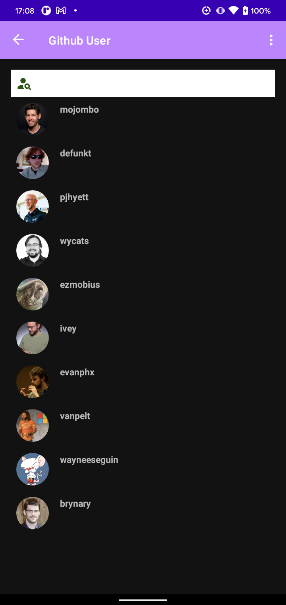
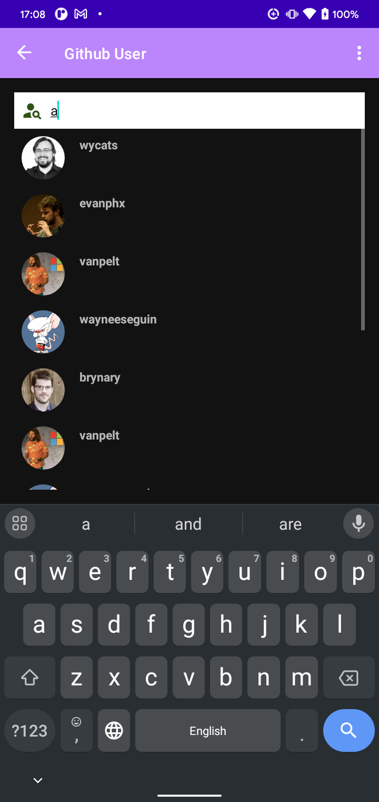
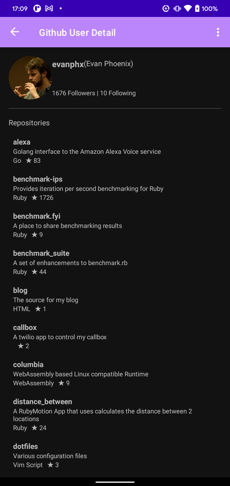
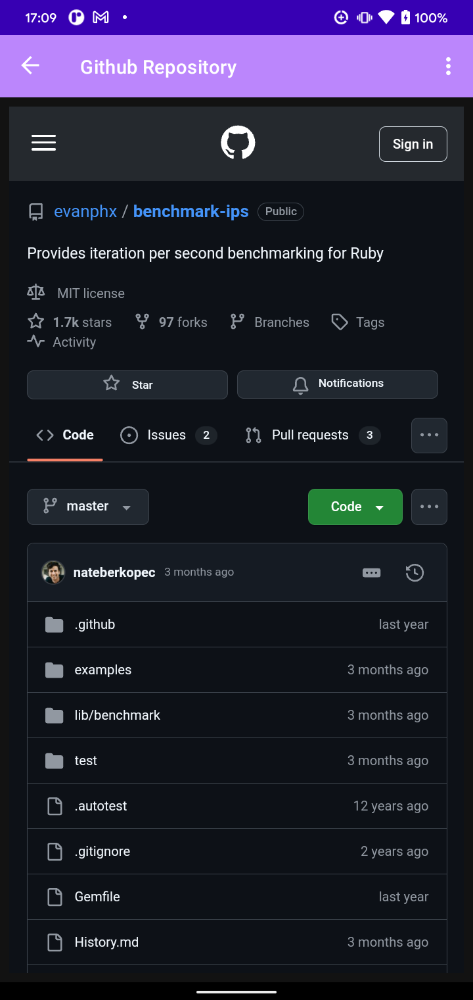

# GitHub User & Repository Explorer

This project is an Android application built to explore GitHub users and repositories. It includes the following features:

## **Features**

### 1. Github User List 
- Displays a list of GitHub users with the following details:
    - Username
    - Avatar
- Includes a search bar for filtering of users by username locally.
- Supports infinite scrolling: initially loads 10 users, and fetches 10 more when scrolled to the bottom.
- Clicking on a user navigates to the **Github User Detail Screen**.

### 2. Github User Detail
- Shows the following details about a selected user:
    - Avatar
    - Username
    - Full Name
    - Total Followers and Following counts
- Displays a list of non-forked repositories created by the user with:
    - Repository name
    - Development language
    - Star count
    - Description
- Clicking on a repository opens the **WebView Screen**.

### 3. WebView Screen
- A WebView that loads the GitHub repository's web page.
- Provides an in-app browsing experience for viewing repository details.

---

## **Technologies Used**
- **Kotlin**: Primary programming language.
- **Android Jetpack Components**:
    - Navigation Component for managing navigation between screens.
    - ViewModel for state management.
    - LiveData for reactive data binding.
- **Retrofit**: For network calls to the GitHub API.
- **RecyclerView**: For displaying lists of users and repositories.
- **Glide**: For displaying image of users.
- **WebView**: For in-app repository page browsing.

---

## **GitHub API Documentation**
This application interacts with the GitHub API. Refer to the official documentation for more details:

- [GitHub REST API v3](https://developer.github.com/v3/)
- [Authentication Using Personal Access Tokens](https://developer.github.com/v3/guides/getting-started/#oauth)
- [My Postman API](https://documenter.getpostman.com/view/14701705/2sAYBYfqAC)
---

## **Screenshots**
Github User List Screen

Github User Detail Screen(with Repository List)

Github Repository WebView Screen
